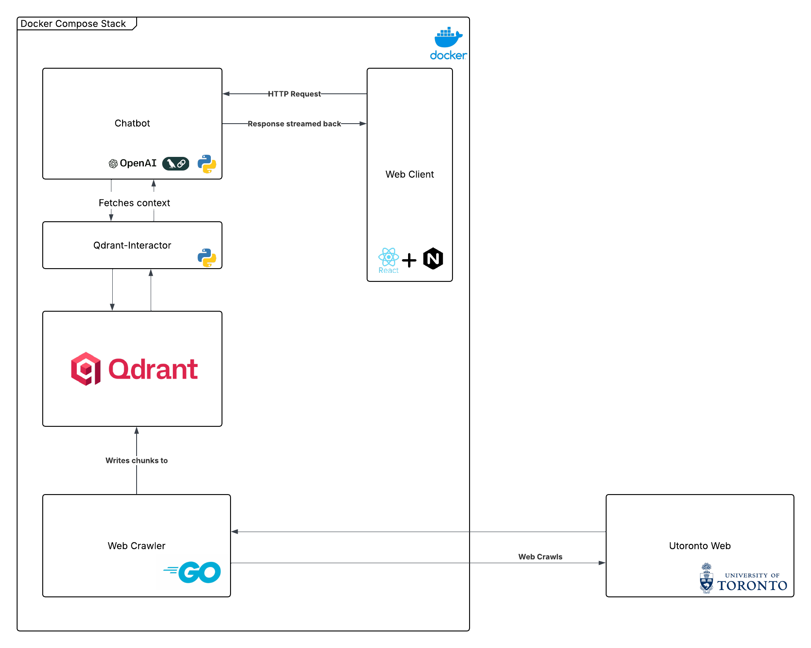

# Chat CS Agent
___

&nbsp;
### The project
This project started off as just a web-crawler, but I decided I wanted it wrapped in a chatbot because the chunks weren't very nice to serve raw. The total Chat-CS project is this:
- The web-crawler microservice crawls through the UofT department of computer science websites, splitting text into chunks and sending them to the qdrant-interactor microservice
- Qdrant-interactor vectorizes the chunks using [BAAI/bge-small-en](https://huggingface.co/BAAI/bge-small-en) and stores them in Qdrant
- Users can then interact with the chatbot via the web-client service which uses RAG to answer UofT CS related questions

Crucially, the actual crawling and embedding happens at "compile time" meaning that the chatbot doesn't actually have to search anything on the web when queried, making it quite fast. All microservices are Dockerized, orchestrated with Docker Compose, and served on Rocinante, my Raspberry Pi 4.

&nbsp;

### The Stack:

<ul>
    <li>
         Go
    </li>
    <li>
         Qdrant
    </li>
    <li>
         React
    </li>
    <li>
         LangChain
    </li>
</ul>

&nbsp;

## Project Diagram

&nbsp;

## Project Components
___
&nbsp;
### Docker Compose Stack
This project follows a microservice architecture, where each service is a containerized application running in a Docker Compose Stack. Inter-container dependencies and environment variables are handled in one docker-compose.yml file at the root of the project.

&nbsp;

### Web Crawler
To gather all of the data, I wrote a web crawler application using Go. This crawler starts at the root link [web.cs.toronto.edu/people/faculty-directory](https://web.cs.toronto.edu/people/faculty-directory), which is the DCS faculty page. It chunks up the text, sending it to the Qdrant-Interactor service to be embeded, then adds any links found to the queue of websites to visit, and continues. It stops upon reaching a certain depth.

&nbsp;

### Qdrant-Interactor
The Qdrant-Interactor microservice serves as a global interface for the Qdrant Database, and is used by both the Web-Crawler and Chatbot services. It handles the embedding of strings, as well as the addition of new chunks, and querying (using cosine similarity). It is written in Python, and uses the [BAAI/bge-small-en](https://huggingface.co/BAAI/bge-small-en) model with FastEmbed to perform embeddings to embed to 384 dimensional vectors.

&nbsp;

### Chatbot
The Chatbot microservice is exactly what it sounds like, using LangChain and OpenAI to run a simple chatbot (using GPT-4.0 mini). It uses FastAPI to handle HTTP requests, and includes token streaming for a smooth user experience. It queries Qdrant-Interactor with the user's questions in order to inject relevant context from the UofT DCS website for factually correct answers, as well as providing the user with links to context.

&nbsp;

### Web-Client
The user gateway to the application is a React, Tailwind and TypeScript frontend, which is deployed to Rocinante and hosted using Nginx.

&nbsp;

## Future additions
____
&nbsp;

There are many features I hope to add to this project, but they are complicated enough that I would want to do them alongside a professor or supervisor. I hope to either work with the University of Toronto to make this project into a real service for the DCS, or at least to continue this project as a CSC490 Capstone Design Project. That being said, my TODO list is:
- Augment vector database with a normal inverted index database, allowing keyword search of certain words that aren't embedded to anything meaningful (for instance course codes)
- Change from simple chatbot to an agent with actual tools, allowing it to dynamically use the inverted index if context isn't good
- Implement some sort of reasoning or chain of thought, allowing multiple queries to vector database with targetted requests for context
- Improve chunking strategy for better context
- **Scale the crawl to crawl ALL of the UofT websites, making this into Chat UofT!**