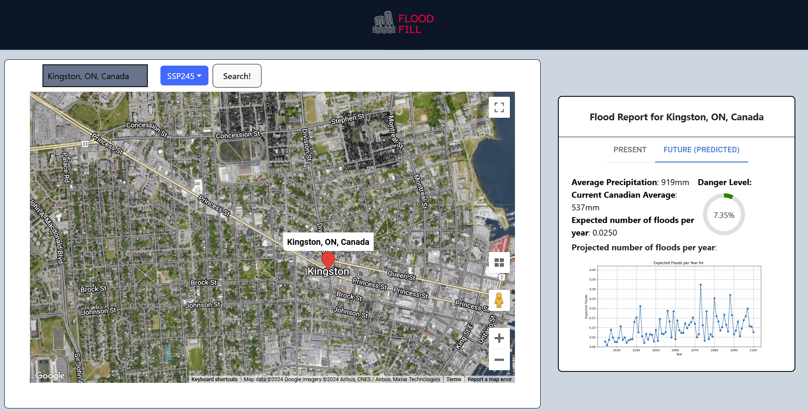
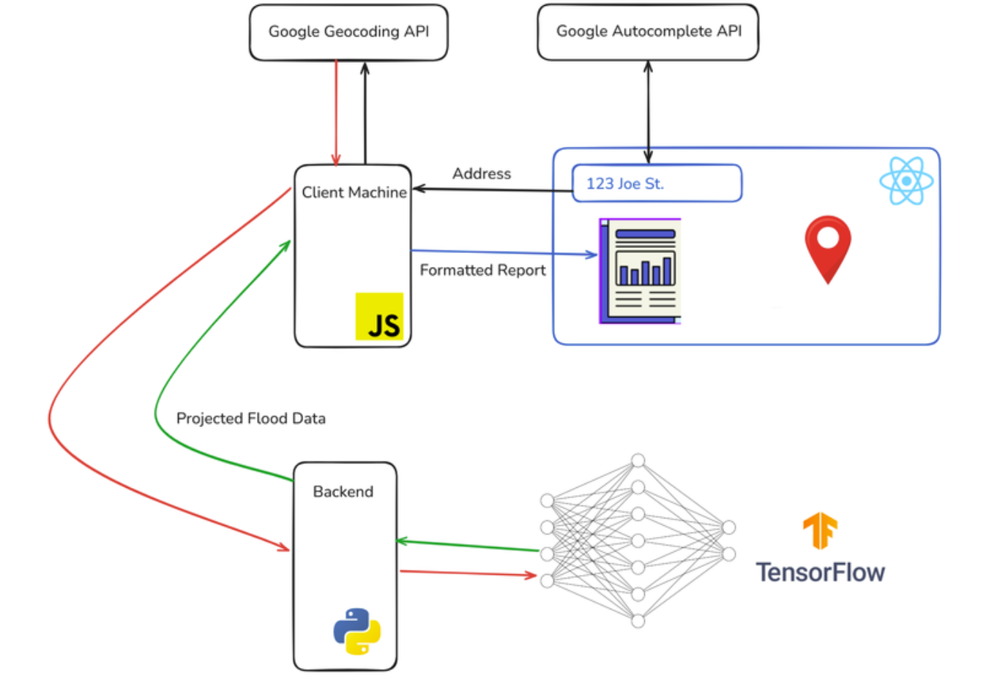
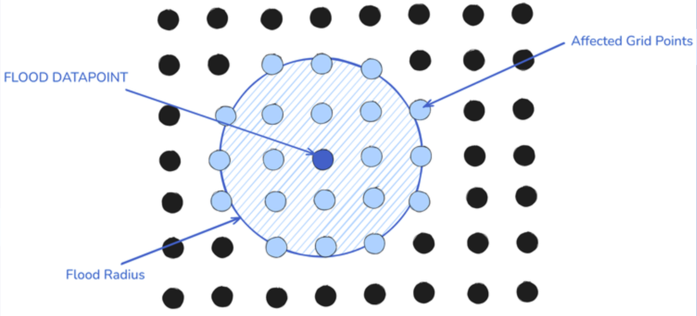

# Flood Fill (NewHacks 2024 2nd place) 
___

&nbsp;
### Project Description
Flood Fill is a full stack application that I developped alongside [Tyson Caul](https://github.com/tjcaul) and [Alex Lewis](https://github.com/alexlewis9) during the UofT NewHacks 2024 Hackathon. This goal of the project is to generate a flood risk assessment for any location in Canada, as floods are the most common and costly disaster in Canada. With climate change increasing flood risks, and housing prices on the rise, the goal of Flood Fill is to allow users to make smart decisions when shopping for real estate. Flood Fill uses a React frontend with integrated Google Maps, and uses a TensorFlow Neural Net in the backend to make predictions (served via Flask). Check out the [Devpost](https://devpost.com/software/flood-fill) for more info!

&nbsp;

### The Stack:

<ul>
    <li>
         TensorFlow 
    </li>
    <li>
         React
    </li>
    <li>
         Google Cloud Platform
    </li>
    <li>
         Flask
    </li>
</ul>

&nbsp;

## Flood Fill Web GUI + Diagram

    
    

## Project Components
___
&nbsp;

### Data collection, merging, and cleaning
To train our model, we combined two datasets from the Government of Canada: [Historical Flood Events | Natural Resources Canada](https://open.canada.ca/data/en/dataset/fe83a604-aa5a-4e46-903c-685f8b0cc33c/resource/73306f3d-8367-463e-899a-7a3854e6b2ab) and [CanDCS-U6 Precipitation History & Predictions | Environment and Climate Change Canada](https://open.canada.ca/data/en/dataset/f73d6939-912a-4add-a291-c233fc5d1946). Since the historical flood dataset only contained one point per flood, we used a "flood propagation algorithm" to simulate all of the points that would be affected by the flood. See the diagram below.

&nbsp;

### Backend: TensorFlow + Flask
In the backend, we created a Neural Net using Python and TensorFlow and trained it using the precipitation dataset combined with the flood dataset, which comprised over 100 million datapoints. Given latitude and longitude coordinates, it predicts how many floods (on average) will affect the position. We also calibrated it to account for different climate change scenarios (SSP scenarios), which affects what the flood risk will be by the year 2100.

&nbsp;

### Frontend: React + Google Cloud Platform
On the frontend, we created a Web GUI featuring an integrated Google Maps that users can use to seamlessly search locations and generate reports. It includes an autocompleting search bar and users can pin multiple locations. It also generates a nicely formatted flood risk report for present and future, including a danger level and projected numbers for future floods. Additionally, it takes the location that the user chooses in google maps and converts it to latitude and longitude using Google's Geocoding API.