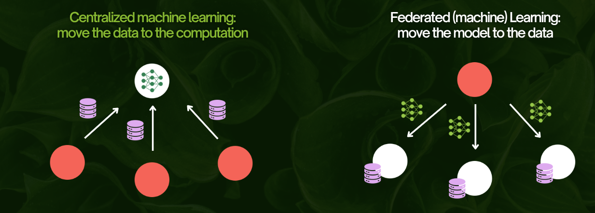
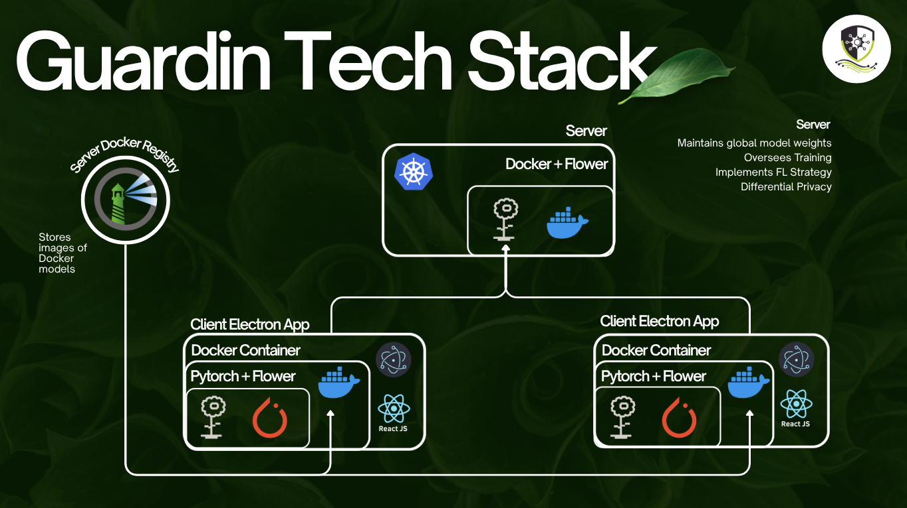
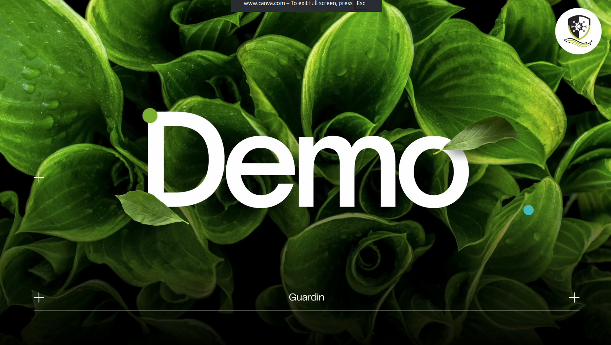
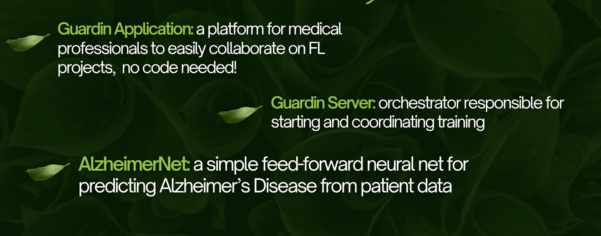

    

&nbsp;

### Abstract
The use of machine learning in the healthcare domain has exploded over the last 10 years, with publications on the topic increasing tenfold over the last 10 years [1]. This is primarily due to the theoretically large amount of data, and high potential upside. However, in practice, healthcare data is highly fragmented, and it is incredibly hard for institutions to share data due to its sensitive nature. Our project uses Federated Learning, a novel concept introduced in 2016 [2] by Google, in order to facilitate inter-hospital collaboration for AI training. Federated learning operates by giving every client a copy of the model to train, then having each client train the model independently, sengind only gradient updates to a server holding the global model weights. This server can aggregate updates from different sources, then send out updated weights to all clients, allowing them to continue training. This essentially allows from training a single model on all datasets without risking exposure of sensitive data.

&nbsp;

### Project Description
Our project Guardin allows healthcare professionals to collaboratively train AI models on sensitive data without centralizing data through the use of Federated Learning. We built a desktop application to easily drag and drop data, a server to orchestrate training, and a simple feed-forward neural network as proof of concept.

&nbsp;

### The Stack:

&nbsp;

## Guardin Application Demo

      

&nbsp;

## Project Components

&nbsp;

### Guardin Server
___
The Guardin Server is an orchestrator in charge of starting and managing training. It holds the global model weights, sends them out, and collects the weight updates from clients. It aggregates them using the FedAvg strategy, also implementing server-side differential privacy [3] to minimize damage of potential reconstruction attacks. It runs in Kubernetes in a Docker container. Another component of the server is the Harbor Docker registry, which contains the images of all Dockerized models, which the Guardin Application pulls and builds when downloading a model.

&nbsp;

### Guardin Application
___
The Guardin Application is an Electron.js desktop application, developped in React and TypeScript. Through the app, users can download Dockerized models, and drag and drop their data in. This mounts their data in the container. Then, they can start up the model, which will listen for server instructions (weights, when to start and stop training, when to evaluate...). Finally, the user can extract the final model weights from the container with the click of a button, allowing them to reconstruct the final model. All of this is done without writing any code, because every button press on the app runs bash commands to interact with the container.

&nbsp;

### AlzheimerNet
___
AlzheimerNet is a proof of concept model we built to test the Guardin platform. It is a simple feed-forward neural network developped in PyTorch, wrapped in a Flower Client, and Dockerized and stored in the Harbor Registry. The model is trained on a Kaggle dataset to predict Alzheimer's based on patient data ([Dataset](https://www.kaggle.com/datasets/rabieelkharoua/alzheimers-disease-dataset/data)).

&nbsp;

## Citations
[1] Xie Y, Zhai Y, Lu G. Evolution of artificial intelligence in healthcare: a 30-year bibliometric study. Front Med (Lausanne). 2025 Jan 15  
[2] McMahan, Brendan, et al. "Communication-efficient learning of deep networks from decentralized data." Artificial intelligence and statistics. PMLR, 2017. 
[3] Dwork, Cynthia, et al. "Calibrating Noise to Sensitivity in Private Data Analysis." Theory of Cryptography. TCC 2006, edited by Shai Halevi and Tal Rabin, vol. 3876, Springer, Berlin, Heidelberg, 2006