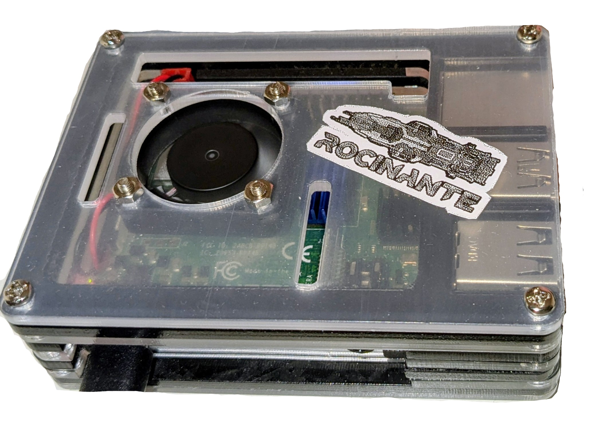

# Raspberry Pi Server (Rocinante)  
___

&nbsp;
### The project
So what is the project? The project was getting my Raspberry Pi 4 (Rocinante) in shape to be a proper web server that I can use to host any future projects I might have. It's now in a state where it's plugged in only to power, so it doesn't need any kind of peripherals, and all monitoring is done via SSH and using [Portainer](https://www.portainer.io/). The only exposed ports on Rocinante are 80 (HTTP) and 443 (HTTPS), and any requests to Rocinante are automatically routed to the correct container using their search URL. All HTTPS traffic is encrypted with SSL/TLS, managed using [Certbot](https://certbot.eff.org/) and [Let's Encrypt](https://letsencrypt.org/). All traffic from my domain "baleinegris.site" is redirected to a No-Ip DDNS that I set up, which is dynamically updated to always point to my router. The server is now hosting many websites, including this one!

&nbsp;

### The Stack:
<div style="display: flex; align-items: center; justify-content: space-between;">
<ul>
    <li>
         Raspberry Pi 4 
    </li>
    <li>
         Nginx
    </li>
    <li>
         Docker 
    </li>
</ul>

</div>

&nbsp;

## Project Diagram


## Project Components
___
&nbsp;

### DDNS (Dynamic Domain Name Server)
Using [No-Ip](https://www.noip.com/remote-access?utm_source=google&utm_medium=cpc&utm_term=no%20ip&utm_campaign=8577915&utm_adgroup=249377595}&matchtype=b&device=c&gad_source=1&gad_campaignid=8577915&gbraid=0AAAAAD_v4kjyXjGkwtm7E1dMywGRfcUq2&gclid=CjwKCAjwprjDBhBTEiwA1m1d0jnvoJVPUg7Qb5kBr7gqUsAXpwpyRZ1TlXDEqyGaRRqvmse_jSw3EBoCzhAQAvD_BwE), I set up a DDNS, which is essentially just a link pointing to an IP, but that can be updated dynamically. Since my router changes IPs dynamically every so often, I need a way to always send traffic from my domain "baleinegris.site" to my router. All this means is that a little daemon runs on Rocinante, and every 5 minutes it sends an encrypted message to No-Ip letting it know what its global IP is. This means my DDNS link always points to the correct IP address.

&nbsp;
### Nginx Reverse Proxy
An important part of this project is [Nginx](https://nginx.org/), which is a HTTP web server and reverse proxy, which I use as the global gateway for the whole Raspberry Pi. The global Nginx server sits above all containers, routing traffic in and out of them. Any traffic incoming to Rocinante is collected by Nginx, decrypted using its Let's Encrypt SSL certificate, then it sends the unencrypted message to the correct internal port based on its ```Host``` header (eg. blog.baleinegris.site vs portfolio.baleinegris.site). Then, any response the container generates is sent back the the global Nginx server, encrypted, and sent to the client. This server allows me to only have to set up two portforwards from my router to Rocinante (ports 80 and 443 for HTTP and HTTPS respectively), and without it I would have to open a new port for each new project.

&nbsp;

### Docker Containers
While not strictly part of this project, I am Dockerizing all of the projects that I want running on Rocinante, as it makes it much more lightweight to deploy, monitor, and version. For websites, this meant that they all are running their own internal Nginx server, which is in charge of the actual serving of content to the global Nginx instance. I am monitoring everything using [Portainer](https://www.portainer.io/), which is an awesome tool allowing me to view all of my images and containers remotely, access their logs, and even start and stop containers.

&nbsp;

### Tycho (NAS)
Since this server is running on a Raspberry Pi, it uses a microSD card for storage, which doesn't have that much space and doesn't love being written to and read from. For this reason, I mounted my Network Attach Storage (NAS) called Tycho, to Rocinante. A NAS is essentially a hard drive that can be accessed over the network using NFS (Network File System), sort of like a private OneDrive or Dropbox. Using the NAS means that all Docker volumes and code needed is stored in a place where I can access it from any computer. For instance, I can code a website on my Desktop (Medina), and then compile and run it on Rocinante without needing to push it to GitHub or DockerHub.