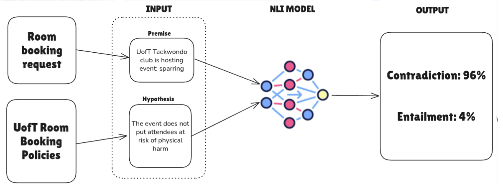
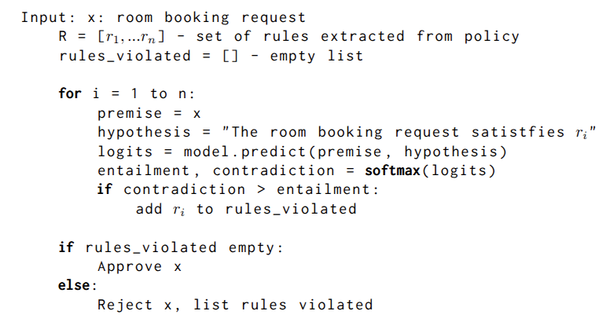
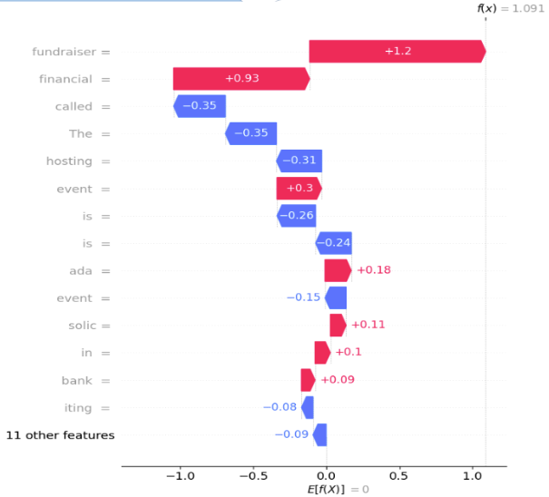

# Automated Room Booking Escalation
___

&nbsp;

### Abstract
I worked on this project as a summer research project under the supervision of Professor Alice Gao and Professor Steve Engels of the University of Toronto. The University of Toronto gets about 1000 room booking requests per year, about 50 of which are escalated, requiring manual review by administration. We were tasked with automating this process using machine learning tools.
The main challenge is that the final pipeline cannot be trained off of past data, both because it is unavailable, but also because any change in the UofT Room Booking Policy should immediately be reflected in the decisions. Therefore, my approach aimed to use pretrained models with general understanding of text, and use them to decide whether requests complied with UofT Room Booking Policies

&nbsp;

### Natural Language Inference

The core of this project uses a pretrained **Natural Language Inference** model, which classifies whether sentence follows logically from another. These models work by taking a robustly pretrained encoder (usually BERT), freezing it, then fine tuning a classification head on an NLI dataset. These datasets have paired inputs: a premise (eg: "The cat is on the mat") and a hypothesis (eg: "There is an animal on the mat."). These pairs have a label, either **entailment** (the hypothesis follows logically from the premise) or **contradiction** (the hypothesis does not follow logically from the premise).

&nbsp;

&nbsp;

### Method

We read through the [UofT Room Booking Policies](https://governingcouncil.utoronto.ca/secretariat/policies/space-university-toronto-policy-temporary-use-october-28-2010) and manually split it in to a list of short rules. Then, we passed all of these rules into Facebook's [XLM-roBERTa NLI model](https://huggingface.co/joeddav/xlm-roberta-large-xnli), paired with the room booking request, following the pseudocode below:

&nbsp;

&nbsp;

### Advantages:

The main advantages of this pipeline are: generalizability and explainability.
- Generalizability: since this NLI model is pretrained and not trained on past room booking requests, it doesn't risk overfitting past data, and will adapt immediately to changes in room booking policy (assuming its rules are updated). Using an encoder like roBERTa which is pretrained on a vast corpus of text ensures a robust understanding of text. When subjected to a text attack using an adversarial generative model, we found that modifications to the room booking request did not have a substantical impact on performance (or would have to dramatically change the request to do so)
- Explainability: the explainability of the pipeline is twofold. First of all, having split the UofT policies into short rules means that when the model rejects a request, it will already pinpoint which rule the request has violated. Additionally, we implemented Shapley Values to express which tokens contributed most heavily to any one decision. These two factors allow us to easily generate a report on why a request was escalated and send it to administration.

Waterfall plot showing feature importance for predicting entailment on input “Royal Bank of Canada is hosting event fundraiser: soliciting donations / Event is financial in nature.” Red bars indicate that the tokens <strong>“fundraiser”</strong> and <strong>“financial”</strong> contributed the most to the prediction

&nbsp;

### Considerations

When performing text attacks, we found that attakcs on the rules were more successful (rules are for instance: "the event must not be financial in nature"). The rules were brittle and sensitive to slight changes in wording. On the plus side, these are the rules that we set ourselves, so we can carefully calibrate them. However, this takes time and labour, meaning that when this gets deployed, and if and when the UofT policies are updated, someone would need to set and adjust the rules carefully, testing them on manual examples before redeploying the model.